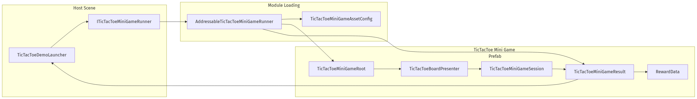
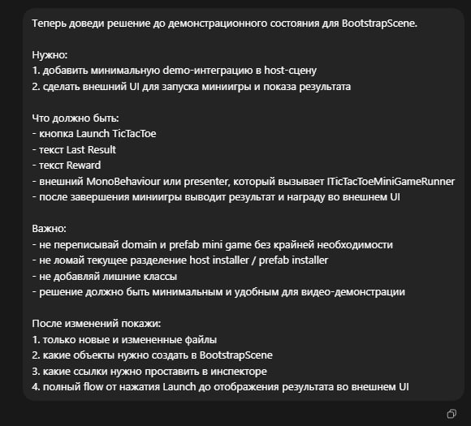
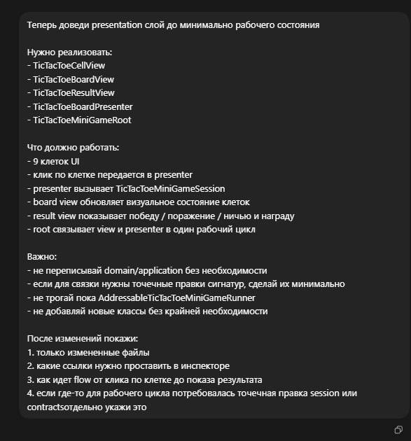
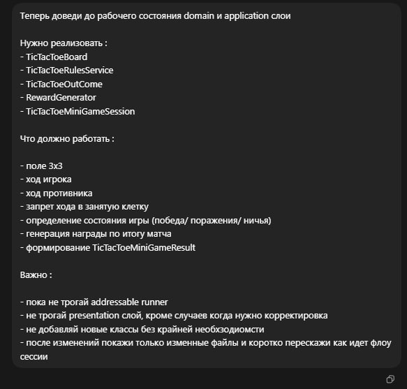
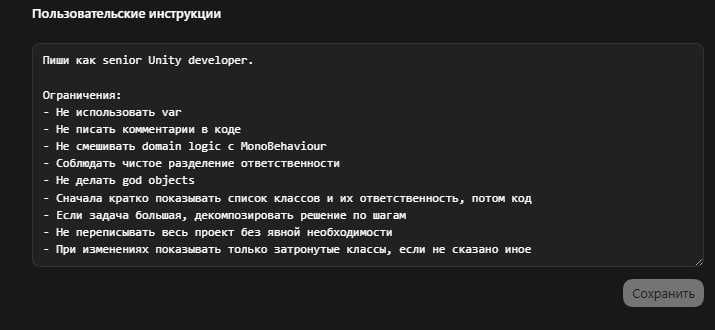

# TicTacToe Test Task

## Минимальную uml диаграмму.



Диаграмма показывает основной модульный поток: host-сцена вызывает миниигру через `ITicTacToeMiniGameRunner`, runner загружает Addressable-prefab, внутри prefab запускается игровой цикл, после завершения наружу возвращается `TicTacToeMiniGameResult`.

```
flowchart LR
subgraph Host["Host Scene"]
Demo["TicTacToeDemoLauncher"]
RunnerApi["ITicTacToeMiniGameRunner"]
end

    subgraph Infra["Module Loading"]
        Runner["AddressableTicTacToeMiniGameRunner"]
        AssetConfig["TicTacToeMiniGameAssetConfig"]
    end

    subgraph Module["TicTacToe Mini Game Prefab"]
        Root["TicTacToeMiniGameRoot"]
        Presenter["TicTacToeBoardPresenter"]
        Session["TicTacToeMiniGameSession"]
        Result["TicTacToeMiniGameResult"]
        Reward["RewardData"]
    end

    Demo --> RunnerApi
    RunnerApi --> Runner
    Runner --> AssetConfig
    Runner --> Root
    Root --> Presenter
    Presenter --> Session
    Session --> Result
    Result --> Reward
    Runner --> Result
    Result --> Demo
```

## Какие ИИ-агенты использовались.

- **Codex** - основной AI-агент, использовался для поэтапной генерации структуры проекта, каркаса файлов, domain/application слоя, presentation слоя, интеграции runner и demo launcher.

---

## Example Prompts

Ниже приложены 4 промта, использованные в процессе работы.

### 1. Demo / Bootstrap


Теперь доведи решение до демонстрационного состояния для BootstrapScene.

Нужно:
1. добавить минимальную demo-интеграцию в host-сцену
2. сделать внешний UI для запуска миниигры и показа результата

Что должно быть:
- кнопка Launch TicTacToe
- текст Last Result
- текст Reward
- внешний MonoBehaviour или presenter, который вызывает ITicTacToeMiniGameRunner
- после завершения миниигры выводит результат и награду во внешнем UI

Важно:
- не переписывай domain и prefab mini game без крайней необходимости
- не ломай текущее разделение host installer / prefab installer
- не добавляй лишние классы
- решение должно быть минимальным и удобным для видео-демонстрации

После изменений покажи:
1. только новые и измененные файлы
2. какие объекты нужно создать в BootstrapScene
3. какие ссылки нужно проставить в инспекторе
4. полный flow от нажатия Launch до отображения результата во внешнем UI
   
### 2. Presentation слой

Теперь доведи presentation слой до минимально рабочего состояния

Нужно реализовать:
- TicTacToeCellView
- TicTacToeBoardView
- TicTacToeResultView
- TicTacToeBoardPresenter
- TicTacToeMiniGameRoot

Что должно работать:
- 9 клеток UI
- клик по клетке передается в presenter
- presenter вызывает TicTacToeMiniGameSession
- board view обновляет визуальное состояние клеток
- result view показывает победу / поражение / ничью и награду
- root связывает view и presenter в один рабочий цикл

Важно:
- не переписывай domain/application без необходимости
- если для связки нужны точечные правки сигнатур, сделай их минимально
- не трогай пока AddressableTicTacToeMiniGameRunner
- не добавляй новые классы без крайней необходимости

После изменений покажи:
1. только измененные файлы
2. какие ссылки нужно проставить в инспекторе
3. как идет flow от клика по клетке до показа результата
4. если где-то для рабочего цикла потребовалась точечная правка session или contractsотдельно укажи это

### 3. Domain / Application слои

Теперь доведи до рабочего состояния domain и application слои

Нужно реализовать :
- TicTacToeBoard
- TicTacToeRulesService
- TicTacToeOutCome
- RewardGenerator
- TicTacToeMiniGameSession

Что должно работать :

- поле 3x3
- ход игрока
- ход противника
- запрет хода в занятую клетку
- определение состояния игры (победа/ поражения/ ничья)
- генерация награды по итогу матча
- формирование TicTacToeMiniGameResult

Важно :

- пока не трогай addressable runner
- не трогай presentation слой, кроме случаев когда нужно корректировка
- не добавляй новые классы без крайней необхзодиомсти
- после изменений покажи только изменные файлы и коротко перескажи как идет флоу сессии

### 4. Глобальный промт


Ограничения:
- Не использовать var
- Не писать комментарии в коде
- Не смешивать domain logic с MonoBehaviour
- Соблюдать чистое разделение ответственности
- Не делать god objects
- Сначала кратко показывать список классов и их ответственность, потом код
- Если задача большая, декомпозировать решение по шагам
- Не переписывать весь проект без явной необходимости
- При изменениях показывать только затронутые классы, если не сказано иное

## Что пришлось исправить или переписать вручную.

После проверки сгенерированного решения часть кода и интеграции была доработана вручную:

- DI-конфигурация была разделена на два installer’а:
    - `TicTacToeHostInstaller` для host-сцены
    - `TicTacToeMiniGameInstaller` для внутренних зависимостей prefab-модуля

Это было сделано для более чистой границы между host-сценой и встроенным модулем миниигры.

- вручную добавлена небольшая задержка между ходом игрока и ответом бота
- вручную добавлена небольшая задержка после завершения матча перед закрытием миниигры
- вручную собраны scene/prefab объекты, inspector references и Addressables-конфигурация
- вручную проверен сценарий внешнего запуска и возврата результата во внешний UI

---

## Видео с демонстрацией что все работает. 

[YouTube Demo](https://youtu.be/fgoCYjguOpQ)
